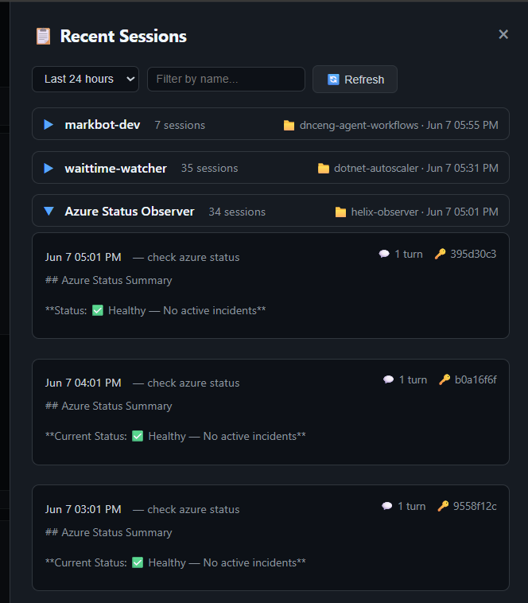
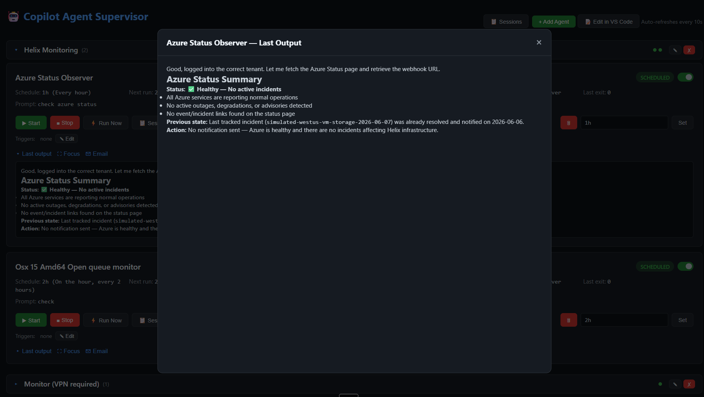

# Copilot Agent Supervisor

A local service that manages and schedules Copilot CLI agent sessions with a web dashboard.


## Prerequisites

- **Node.js** v18+ — [https://nodejs.org](https://nodejs.org)
- **GitHub Copilot CLI** — installed globally via `npm install -g @githubnext/github-copilot-cli` (or available at a custom path set in `agents.json`)
- **Windows 10/11** — the dashboard uses Windows-specific features (Scheduled Tasks, `start` command, PowerShell folder picker)
- **Git** (optional) — for version-controlling your `agents.json` and plugin overlays

## Quick Start

```bash
cd C:\repos\sessions
npm install
npm start
```

Dashboard: http://localhost:3847

## Features

- **Rich scheduling** — simple intervals (`30m`, `1h`), human-readable (`weekdays at 9am`), or cron expressions
- **Web dashboard** — view status, last results, errors, start/stop agents, change schedules
- **Durable agents** — marked agents always restart on service boot and retry on failure
- **Resume sessions** — the Terminal button drops you directly into the Copilot CLI session where an agent left off, so you can continue the conversation interactively
- **Session browser** — view all past sessions grouped by agent, with timestamps, turn counts, and output previews
- **Focus mode** — open any agent's last output in a clean, full-screen modal for easy reading
- **Markdown rendering** — agent output is rendered as formatted markdown with headings, links, lists, and code blocks
- **Template-driven triggers** — chain agents together and pass output/metadata between them using `{{ trigger.output }}` syntax
- **Email reports** — send any agent's last output as a formatted HTML email with one click
- **Inline editing** — double-click to edit agent names, prompts, and schedules directly in the dashboard
- **Session recovery** — on restart, recovers last output from Copilot session history so no results are lost
- **Auto-reload** — external edits to `agents.json` are picked up automatically (no restart needed)
- **Error visibility** — stderr displayed in red, auto-expanded on errors
- **Run history** — SQLite-backed log of all executions with output capture
- **REST API** — full programmatic control
- **VS Code integration** — button to open project in VS Code Insiders

### Session Browser

Browse all past agent sessions with filtering and search. Each session shows the prompt used, turn count, and a preview of the output.



### Focus Mode

Open any agent's last output in a distraction-free full-screen view with rendered markdown.



## Install as Windows Scheduled Task (survives reboots/sleep)

Run from an **elevated (admin)** terminal:

```bash
npm run install-service
```

This creates a Windows Scheduled Task with:
- **Logon trigger** — starts when you sign in
- **5-minute watchdog** — restarts the service if it dies (sleep, crash, etc.)
- **`MultipleInstances=IgnoreNew`** — prevents duplicate processes

To remove:
```bash
npm run uninstall-service
```

## Configuration

Edit `agents.json` to add/remove agents:

```json
{
  "id": "my-agent",
  "name": "My Agent Display Name",
  "cwd": "C:\\repos\\my-repo",
  "agent": "Agent Display Name",
  "schedule": "weekdays at 9am",
  "prompt": "do the thing",
  "durable": true,
  "copilotPath": "C:\\Users\\you\\AppData\\Roaming\\npm\\copilot.cmd",
  "triggers": {
    "onSuccess": ["other-agent-id"],
    "onFailure": ["alert-agent-id"]
  }
}
```

### Conditional triggers

Agents can trigger other agents based on their exit status:

```json
"triggers": {
  "onSuccess": ["deploy-agent"],
  "onFailure": ["alert-agent", "rollback-agent"],
  "onComplete": ["cleanup-agent"]
}
```

| Trigger | Fires when |
|---------|------------|
| `onSuccess` | Agent exits with code 0 |
| `onFailure` | Agent exits with non-zero code |
| `onComplete` | Agent finishes regardless of exit code |

Each trigger value can be a single agent ID string or an array. Triggers are displayed in the dashboard with colored badges (green for success, red for failure, blue for complete).

### Template variables in triggered prompts

Triggered agents can reference data from the agent that triggered them using `{{ }}` template syntax in their prompt:

```json
{
  "id": "alert-analyzer",
  "prompt": "Here's our health report:\n\n{{ trigger.output }}\n\nAnalyze to see if we need to alert the team.",
  "triggers": {}
}
```

**Available variables:**

| Variable | Description |
|----------|-------------|
| `{{ trigger.output }}` | Full output from the triggering agent |
| `{{ trigger.name }}` | Display name of the triggering agent |
| `{{ trigger.id }}` | Agent ID of the triggering agent |
| `{{ trigger.exitCode }}` | Exit code (0 = success) |
| `{{ trigger.prompt }}` | Prompt that was used for the triggering run |
| `{{ trigger.startedAt }}` | ISO timestamp when the triggering run started |
| `{{ trigger.finishedAt }}` | ISO timestamp when it finished |
| `{{ chain[N].output }}` | Output from the Nth agent in the chain (0 = earliest) |
| `{{ chain[N].name }}` | Name of the Nth agent in the chain |
| `{{ chain.length }}` | Number of prior agents in the chain |

**Chain context:** When triggers form a chain (A → B → C), each downstream agent sees the full history. Agent C's `trigger` is B, and `chain[0]` is A. Unresolved variables (typos, missing data) are left as-is.

**Example chain:**
```json
[
  { "id": "health-check", "prompt": "Check system health", "triggers": { "onComplete": ["analyzer"] } },
  { "id": "analyzer", "prompt": "Report: {{ trigger.output }}. If critical, summarize for alerting.", "triggers": { "onSuccess": ["notifier"] } },
  { "id": "notifier", "prompt": "Original health: {{ chain[0].output }}\nAnalysis: {{ trigger.output }}\nSend notification if needed." }
]
```

### Schedule formats

| Format | Example | Description |
|--------|---------|-------------|
| Simple interval | `30m`, `1h`, `2h` | Cron-aligned to clock boundaries |
| Human-readable | `every hour at :30` | At 30 minutes past each hour |
| Day schedule | `weekdays at 7am and 9pm` | Mon-Fri at 7am and 9pm |
| Day list | `M,T,W,Th,F at 9am` | Specific days |
| Every N | `every 15 minutes` | Every 15 minutes |
| Cron expression | `0 7,21 * * 1-5` | Standard 5-field cron |

### Agent config fields

| Field | Required | Description |
|-------|----------|-------------|
| `id` | Yes | Unique identifier |
| `name` | Yes | Display name in dashboard |
| `cwd` | Yes | Working directory for copilot CLI |
| `agent` | Yes | Agent name (as shown in `copilot --help` or agent list) |
| `schedule` | Yes | Schedule expression (see formats above) |
| `prompt` | Yes | Prompt text sent to the agent each run |
| `durable` | No | If `true`, always starts on boot regardless of DB state |
| `copilotPath` | No | Full path to `copilot.cmd` (auto-resolved if omitted) |
| `allowAll` | No | If `false`, omits `--yolo` flag (default: `true`) |
| `triggers` | No | Conditional triggers: `{ onSuccess, onFailure, onComplete }` |

## API

| Method | Endpoint | Description |
|--------|----------|-------------|
| GET | `/api/agents` | List all agents with status |
| GET | `/api/agents/:id` | Get single agent status |
| GET | `/api/agents/:id/history` | Get run history |
| POST | `/api/agents/:id/start` | Start scheduled agent |
| POST | `/api/agents/:id/stop` | Stop agent |
| POST | `/api/agents/:id/run` | Trigger immediate run |
| PUT | `/api/agents/:id/schedule` | Update schedule (persists to `agents.json`) |
| PUT | `/api/agents/:id/triggers` | Update triggers (persists to `agents.json`) |
| POST | `/api/agents` | Add new agent (JSON body) |
| DELETE | `/api/agents/:id` | Remove agent |
| POST | `/api/reload` | Reload agents.json |
| POST | `/api/schedule/describe` | Describe a schedule string |
| POST | `/api/open-editor` | Open project in VS Code Insiders |
