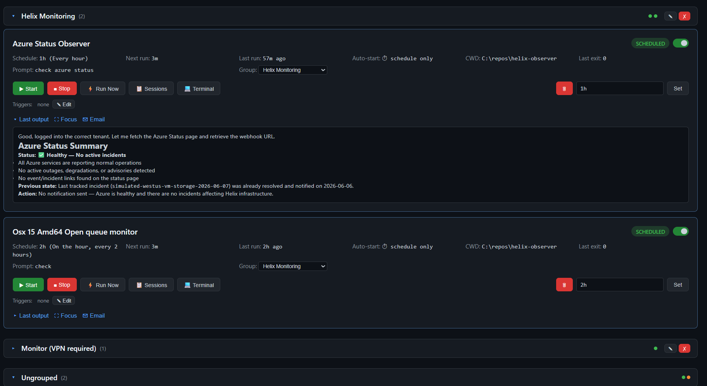
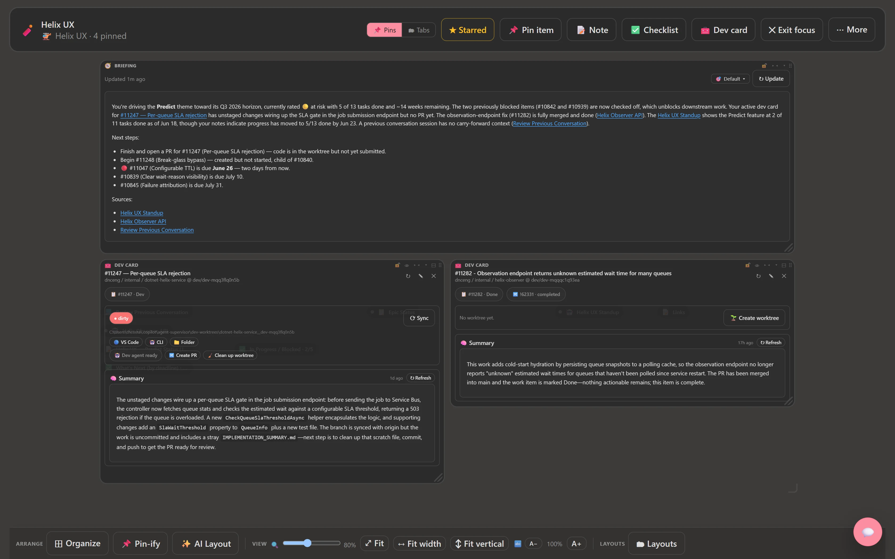
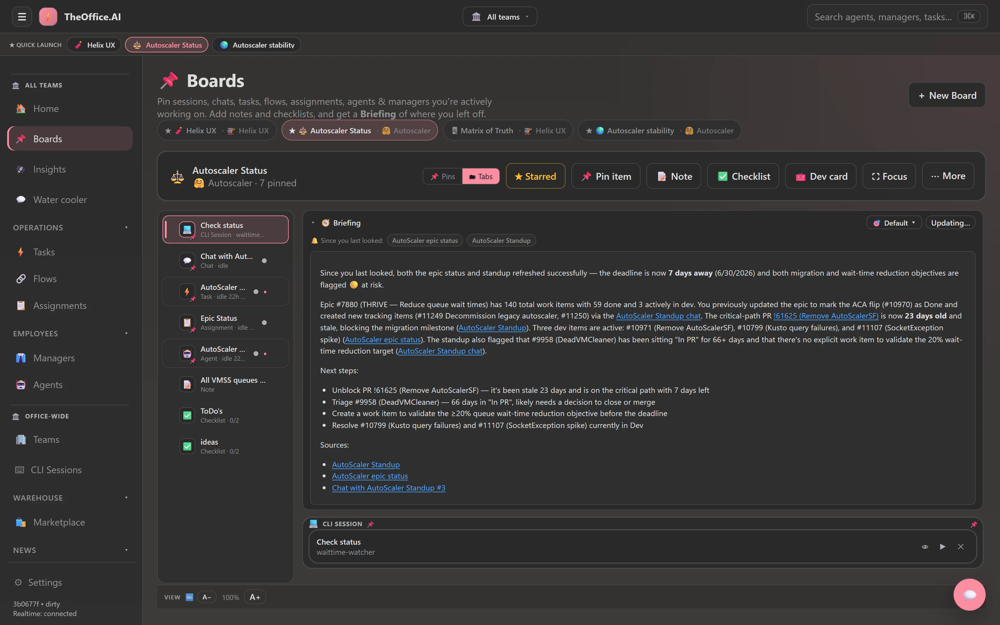
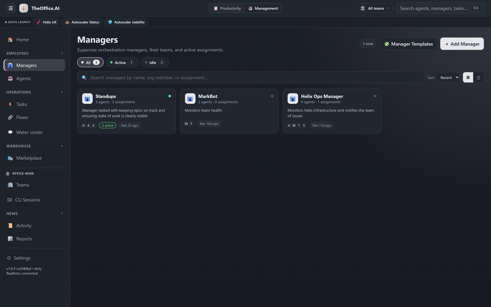
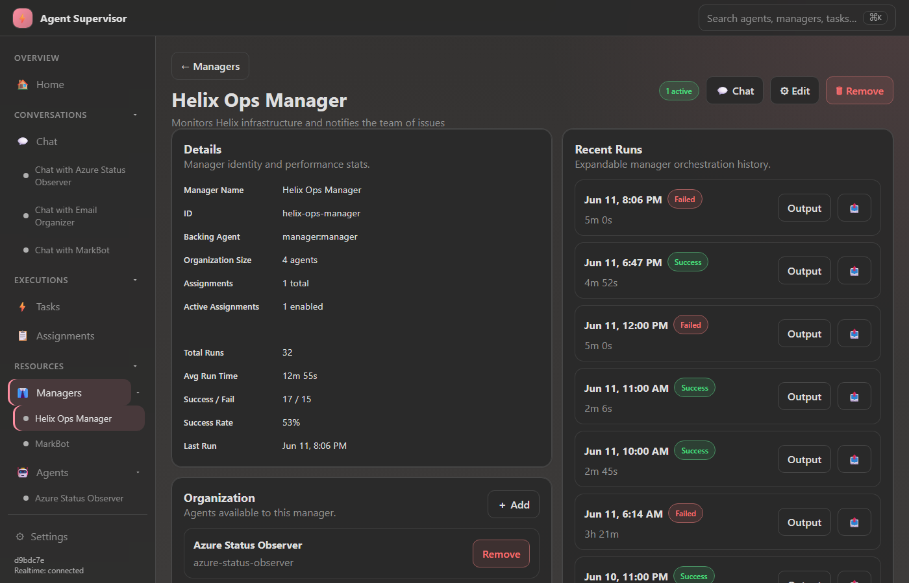
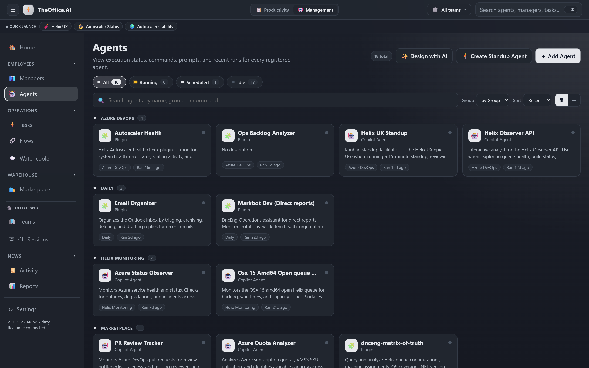
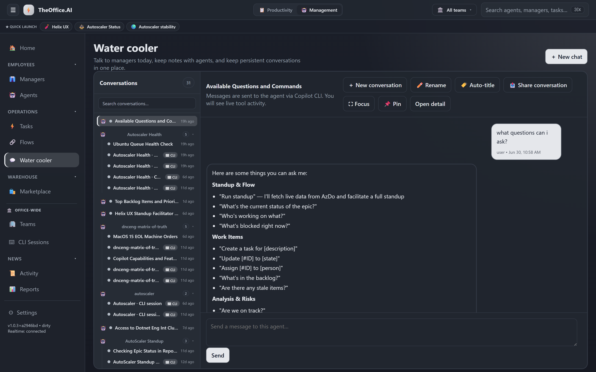
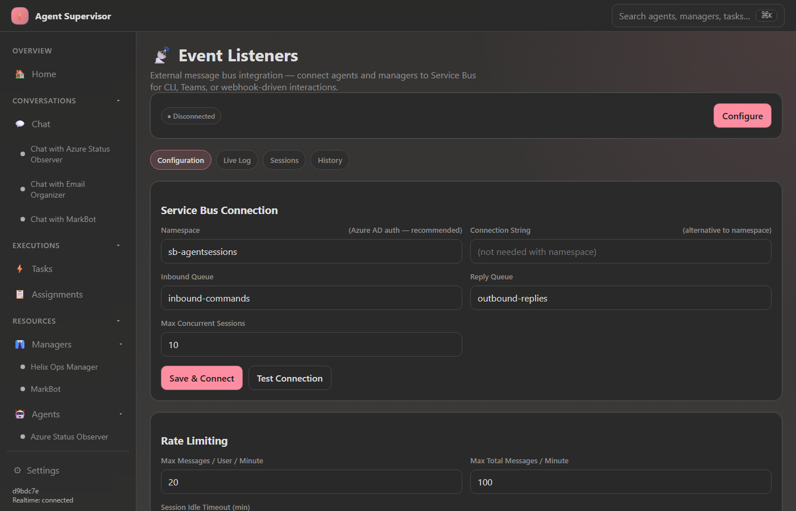
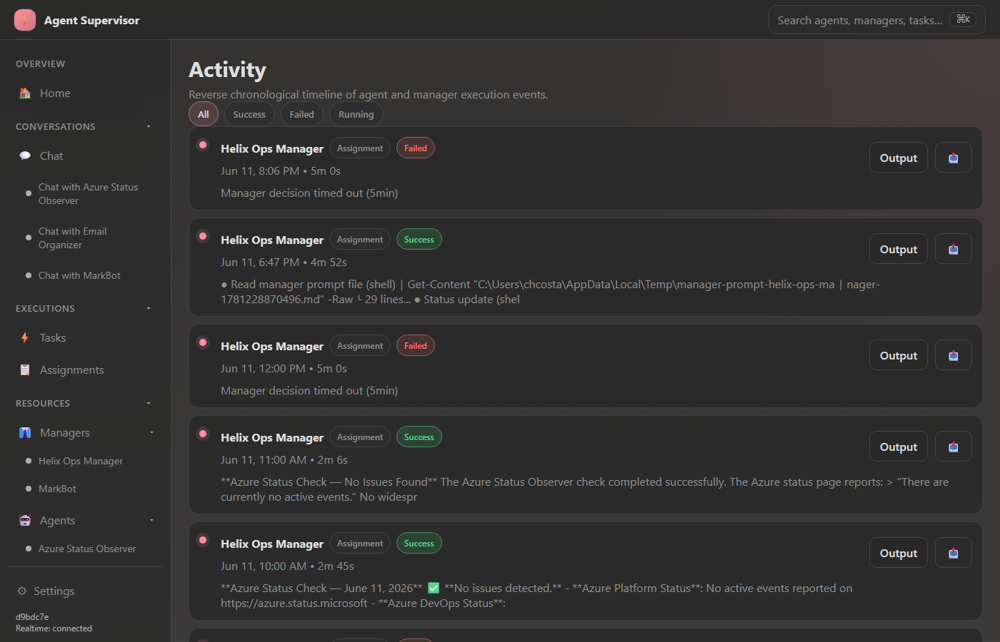
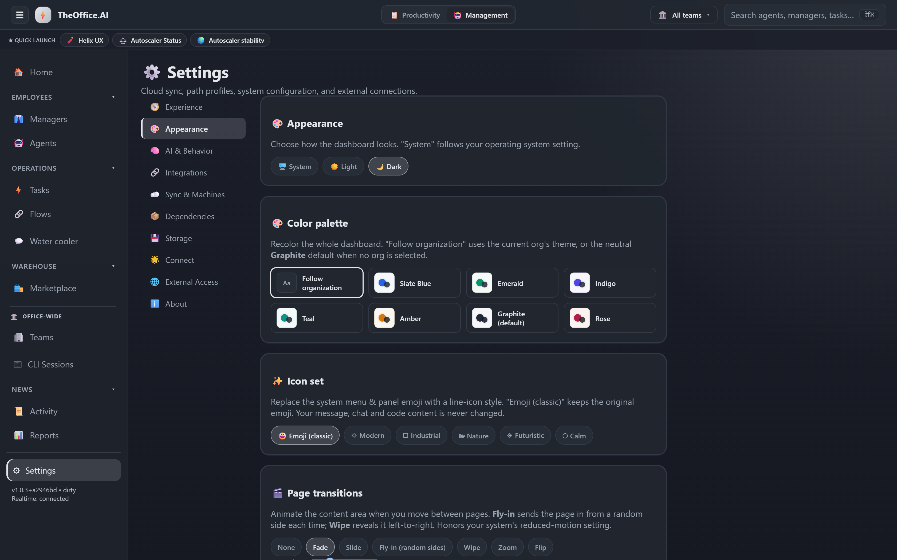

# TheOffice.AI

An intelligent orchestration platform for GitHub Copilot CLI agents. Schedule, monitor, and chain AI agents together — with Managers that coordinate multi-agent workflows, real-time chat, cloud sync, and a full web dashboard.



## 🎬 Demo

A guided tour of TheOffice.AI — agents, managers, an always-on AI briefing, and the Board that runs your day, including live dev cards that track in-progress work. Every agent runs locally, on your machine, with your own credentials.


▶ **[Watch the full 4½-minute narrated demo, with audio](docs/theoffice-ai-demo.mp4)** — opens an inline player right here on GitHub, no download required.

## 📸 Screenshots

**Board — Pin view (focus mode):** a free-form, spatial workspace. Pin sessions, chats, tasks, agents, notes, and live **dev cards**; an always-on AI **Briefing** keeps you oriented on where you left off.



**Board — Tabbed view:** the same pinned items rendered as a compact tab rail with a focused detail pane, with the Briefing surfacing deltas since you last looked.



## Highlights

- 🤖 **Manager Orchestration** — AI-powered managers coordinate multiple agents, analyzing output and routing work
- 💬 **Interactive Chat** — Talk to any agent or manager in real-time with streaming responses and auto-retry
- 📅 **Rich Scheduling** — Human-readable schedules, cron, intervals, and manager assignments
- ☁️ **Cloud Sync** — Sync configuration across machines via Azure Blob Storage with leader election
- 🔗 **Event System** — Azure Service Bus integration for cross-system event-driven automation
- 📊 **Activity Timeline** — Full execution history with output capture and error visibility
- 🔌 **Plugin System** — Extend agents with MCP servers for tools, APIs, and external integrations

---

## 💻 Download (Windows desktop)

**[⬇ Download the latest Windows installer](https://github.com/chcosta/TheOffice.AI/releases/latest)** — or grab it directly:

**[TheOffice.AI_1.0.0_x64-setup.exe](https://github.com/chcosta/TheOffice.AI/releases/download/v1.0.0/TheOffice.AI_1.0.0_x64-setup.exe)** (~215 MB)

The desktop app is a native shell (Tauri v2) that runs the same server + SPA as a
local sidecar and loads it in WebView2 — **no browser required**. It installs
per-user (no admin), and on first launch offers to install optional prerequisites
(Git, Azure CLI, ripgrep) via winget. Copilot CLI sign-in (`~/.copilot`) is a
separate one-time step. See [`desktop/README.md`](desktop/README.md) for how the
sidecar works and how to rebuild the installer.

---

## Quick Start

Run in the browser (dev / LAN / mobile):

```bash
npm install
npm start
```

Open **http://localhost:3847** in your browser. The browser and desktop apps share
the exact same `server.js` + `public/app.html` — the desktop shell just wraps them.

## Prerequisites

- **Node.js** v18+
- **GitHub Copilot CLI** — installed globally or at a custom path
- **Windows 10/11** — uses Windows-specific features (Scheduled Tasks, PowerShell)
- **Azure account** (optional) — for Service Bus events and cloud sync

---

## Core Features

### 🏠 Dashboard

The home page provides a real-time overview of all running agents, recent activity, and system health at a glance.


### 🤖 Managers

Managers are intelligent orchestrators that coordinate multiple agents. A manager can:
- Run agents in sequence, passing output between them
- Analyze results and make decisions about what to do next
- Be assigned scheduled "assignments" (saved prompts on a schedule)
- Be chatted with interactively for ad-hoc work



**Manager Detail** — Configure agents in the manager's organization, create assignments, view execution history:



### 🕵️ Agents

Register and manage individual Copilot CLI agents. Each agent has a working directory, prompt, schedule, and optional triggers.



### 💬 Chat

Interactive conversations with any agent or manager. Supports streaming responses, markdown rendering, auto-retry on failures, and a "Continue" button for recovering from errors.



### 📡 Events

Azure Service Bus integration for event-driven automation. Configure listeners that trigger agents when messages arrive on specific topics/queues.



### 📊 Activity

Reverse-chronological timeline of all agent and manager executions. Filter by status, see durations, and drill into output.



### ⚙️ Settings

Cloud sync configuration, system info, and keyboard shortcuts. Configure Azure Blob Storage for multi-machine sync with automatic leader election.



---

## Manager Orchestration

Managers are the key differentiator — they're AI agents themselves that understand how to coordinate other agents.

### Example: Azure Monitor → Email Alert

```
Manager: "Helix Ops Manager"
Organization: [Azure Monitor Agent, Email Sender Agent]
Assignment: "Check Azure health, if issues found, email chcosta@microsoft.com"
Schedule: "every 15 minutes"
```

The manager will:
1. Run the Azure Monitor agent
2. Analyze the output — is Azure healthy?
3. If unhealthy → invoke the Email Sender agent with the health report
4. All decisions are made by the manager's AI, not hardcoded logic

### Creating a Manager

```json
{
  "id": "my-manager",
  "name": "My Operations Manager",
  "agents": ["agent-1", "agent-2"],
  "plugins": ["mcp-server-tool"],
  "assignments": [
    {
      "id": "daily-check",
      "name": "Daily Health Check",
      "prompt": "Run health check, summarize findings, alert if critical",
      "schedule": "weekdays at 9am"
    }
  ]
}
```

---

## Cloud Sync & Leader Election

Sync your configuration across multiple machines with only one running scheduled tasks at a time.

### How it works

1. **First machine** saves sync settings → acquires blob lease → becomes **Leader** → auto-pushes config
2. **Second machine** connects → lease held → becomes **Standby** → pulls config from cloud
3. **Leader dies** → lease expires (60s) → standby acquires lease → promoted to leader
4. **Force takeover** — "Take Leadership" button for manual failover

### What syncs
- `agents.json`, `managers.json`, `events-config.json`
- `plugins/` and `mcp-configs/` directories
- Path profiles (machine-specific path mappings)

### What stays local
- SQLite database (run history)
- Chat sessions
- `sync-config.json` (per-machine)

---

## Event-Driven Automation

Connect to Azure Service Bus for cross-system event processing:

- **Topics & Subscriptions** — listen for events from external systems
- **Agent Triggers** — automatically run agents when events arrive
- **Dead Letter Handling** — failed events are preserved for debugging

---

## Scheduling

### Schedule formats

| Format | Example | Description |
|--------|---------|-------------|
| Simple interval | `30m`, `1h`, `2h` | Aligned to clock boundaries |
| Human-readable | `every hour at :30` | At 30 past each hour |
| Day schedule | `weekdays at 7am and 9pm` | Mon–Fri at those times |
| Day list | `M,T,W,Th,F at 9am` | Specific days |
| Every N | `every 15 minutes` | Fixed interval |
| Cron | `0 7,21 * * 1-5` | Standard 5-field cron |

---

## Trigger Chains

Agents can trigger other agents based on exit status with full output forwarding:

```json
"triggers": {
  "onSuccess": ["deploy-agent"],
  "onFailure": ["alert-agent"],
  "onComplete": ["cleanup-agent"]
}
```

### Template variables

Triggered agents can reference output from upstream agents:

| Variable | Description |
|----------|-------------|
| `{{ trigger.output }}` | Full output from the triggering agent |
| `{{ trigger.name }}` | Name of the triggering agent |
| `{{ trigger.exitCode }}` | Exit code (0 = success) |
| `{{ chain[N].output }}` | Output from the Nth agent in the chain |
| `{{ chain.length }}` | Number of prior agents in the chain |

---

## Configuration

### Agent config (`agents.json`)

```json
{
  "id": "my-agent",
  "name": "My Agent",
  "cwd": "C:\\repos\\my-repo",
  "agent": "copilot-agent-name",
  "schedule": "weekdays at 9am",
  "prompt": "do the thing",
  "durable": true,
  "triggers": { "onSuccess": ["next-agent"] }
}
```

| Field | Required | Description |
|-------|----------|-------------|
| `id` | Yes | Unique identifier |
| `name` | Yes | Display name |
| `cwd` | Yes | Working directory |
| `agent` | Yes | Copilot agent name |
| `schedule` | Yes | Schedule expression |
| `prompt` | Yes | Prompt text |
| `durable` | No | Auto-start on boot |
| `triggers` | No | `{ onSuccess, onFailure, onComplete }` |

---

## Install as Windows Service

```bash
npm run install-service    # Runs on logon + 5-min watchdog
npm run uninstall-service  # Remove
```

---

## CLI

```bash
npm start              # Start the server
npm run dev            # Start with file watching
npm run install-service   # Install as Windows Scheduled Task
npm run uninstall-service # Remove scheduled task
```

---

## API

| Method | Endpoint | Description |
|--------|----------|-------------|
| GET | `/api/agents` | List all agents with status |
| POST | `/api/agents` | Add new agent |
| GET | `/api/agents/:id` | Get agent status |
| POST | `/api/agents/:id/run` | Trigger immediate run |
| PUT | `/api/agents/:id/schedule` | Update schedule |
| GET | `/api/managers` | List all managers |
| POST | `/api/managers` | Create manager |
| POST | `/api/managers/:id/chat` | Chat with manager |
| POST | `/api/managers/:id/assignments/:aid/run` | Run assignment |
| GET | `/api/chats` | List chat sessions |
| GET | `/api/activity` | Execution timeline |
| GET | `/api/sync/status` | Cloud sync status |
| POST | `/api/sync/push` | Push config to cloud |
| POST | `/api/sync/pull` | Pull config from cloud |
| POST | `/api/export` | Export all configuration |
| POST | `/api/import` | Import configuration |

---

## Architecture

```
┌─────────────────────────────────────────────────────┐
│                   Web Dashboard                      │
│         (Alpine.js SPA @ localhost:3847)             │
└──────────────────────┬──────────────────────────────┘
                       │ REST + SSE
┌──────────────────────▼──────────────────────────────┐
│                   server.js                          │
│        Express API + Real-time Event Stream         │
├─────────────┬────────────────┬──────────────────────┤
│ supervisor  │   manager.js   │   config-sync.js     │
│   .js       │                │                      │
│ Scheduling  │ Orchestration  │  Cloud Sync +        │
│ & Execution │ & Chat         │  Leader Election     │
├─────────────┴────────────────┴──────────────────────┤
│            Copilot CLI (child processes)             │
│         GitHub Copilot AI Agent Runtime             │
└─────────────────────────────────────────────────────┘
         │                              │
    Azure Service Bus              Azure Blob Storage
    (Event Listeners)              (Config Sync)
```

---

## License

Private — internal use only.
