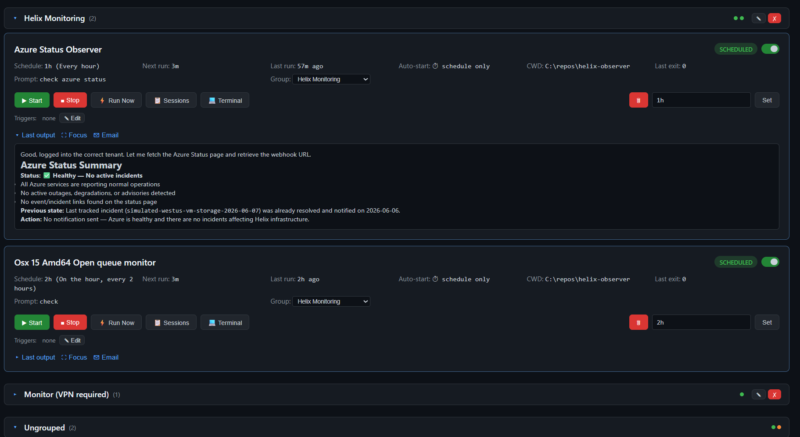

# TheOffice.AI

An intelligent orchestration platform for GitHub Copilot CLI agents. Schedule, monitor, and chain AI agents together — with Managers that coordinate multi-agent workflows, real-time chat, cloud sync, and a full web dashboard.

[](https://github.com/chcosta/TheOffice.AI/actions/workflows/release.yml)
[](https://github.com/chcosta/TheOffice.AI/releases/latest)
[](https://github.com/chcosta/TheOffice.AI/releases/latest)

> ### 💻 [⬇ Download the latest Windows installer](https://github.com/chcosta/TheOffice.AI/releases/latest)
> Native desktop app — **no browser, no command line required.** Installs per-user (no admin).
> Every push to `main` is built and published automatically by GitHub Actions (badge above);
> grab the newest `TheOffice.AI_<version>_x64-setup.exe` from the
> [latest release](https://github.com/chcosta/TheOffice.AI/releases/latest) and run it.



## 🎬 Demo

A guided tour of TheOffice.AI — agents, managers, an always-on AI briefing, and the Board that runs your day, including live dev cards that track in-progress work. Every agent runs locally, on your machine, with your own credentials.


▶ **[Watch the full 4½-minute narrated demo, with audio](docs/theoffice-ai-demo.mp4)** — opens an inline player right here on GitHub, no download required.

## 📚 Learn more

- **[Features & reference →](docs/FEATURES.md)** — what it is, screenshots, Managers, Cloud Sync, Scheduling, Trigger Chains, Configuration, the full API, and the architecture.
- **[Release notes →](https://github.com/chcosta/TheOffice.AI/releases)** — every build is published as a preview release with notes for what changed.

---

## 💻 Install (Windows desktop)

**[⬇ Download the latest preview installer](https://github.com/chcosta/TheOffice.AI/releases/latest)** (~215 MB)

1. Download the `TheOffice.AI_<version>_x64-setup.exe` asset from the
   [latest release](https://github.com/chcosta/TheOffice.AI/releases/latest).
   (Each release also ships a `.sha256` file so you can verify the download.)
2. Run the installer — it installs **per-user, no admin required**.
3. On first launch it offers to install optional prerequisites (Git, Azure CLI,
   ripgrep) via winget, and it will help you sign in to the Copilot CLI (`~/.copilot`)
   as a one-time step.

The desktop app is a native shell (Tauri v2) that runs the same server + SPA as a
local sidecar and loads it in WebView2 — **no browser required**. Your agents run
locally, on your machine, with your own credentials.

> ℹ️ Builds are published automatically by GitHub Actions on every push to `main` as
> **preview releases** using standard prerelease semantic versioning (`vX.Y.Z-preview.N`).
> See [`desktop/README.md`](desktop/README.md) for how the sidecar works and how to
> rebuild the installer.

---

## Prerequisites

The installer bundles the app and offers to install the optional tools below. If you
run from source instead, you'll need these yourself:

- **Node.js** v18+
- **GitHub Copilot CLI** — installed globally or at a custom path
- **Windows 10/11** — uses Windows-specific features (Scheduled Tasks, PowerShell)
- **Azure account** (optional) — for cloud sync

---

## Run from source (advanced / dev)

Most users should just [install the desktop app](#-install-windows-desktop). To run
from source for development, LAN, or mobile access:

```bash
npm install
npm start            # start the server
npm run dev          # start with file watching
```

Open **http://localhost:3847** in your browser. The browser and desktop apps share
the exact same `server.js` + `public/app.html` — the desktop shell just wraps them.

### Install as a Windows Scheduled Task (optional)

```bash
npm run install-service    # Runs on logon + 5-min watchdog
npm run uninstall-service  # Remove
```

---

## License

Private — internal use only.
